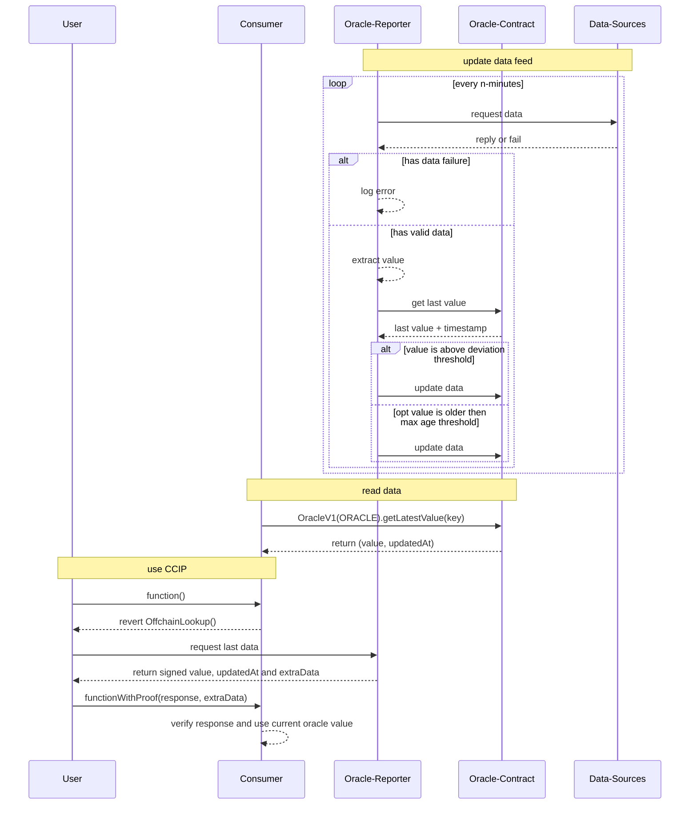

# VeChain General Grant Application Template

## Project Overview 

- Project: Oracle for VET/USD + VTHO/USD Pricing
- Team Name: favo
- Payment Address: `0xcC4B3412161Ea88d0538D2Da15cffa74af0eE9D4`

### Overview

It is currently impossible to get verified fiat value for VET purely on VeChain. A trusted oracle providing accurate data is required to bring in trusted data to the blockchain.

This project will bring VET/USD and VTHO/USD price to Vechain, allowing everyone to utilize fiat pricing in their dApps. 

The main functionality will be open sourced on GitHub, to allow everyone to adapt to their own needs or suggest improvements for the future.


### Project Details

A contract will be deployed that provides the current USD value of VET.

The data is accessible on-chain with:

```sol
interface OracleV1 {
    function getLatestValue(bytes32 id) public view returns (uint256 value, uint256 updatedAt);
}

// id = ethers.utils.formatBytes32String("vet-usd")
(value, updatedAt) = OracleV1(Address).getLatestValue(id);
```

The data is updated in the following situations:

1. **Heartbeat** of 1 day will make sure that data is never older than 24 hours.
2. **Deviation** of n% will ensure that relevant changes on the price will reflect in the data.


The source of data for VET and VTHO is:

3. At least two centralized Exchange (likely Coinbase and Binance)
4. At least two neutral API (likely Coingecko and CoinMarketCap)

Additional sources from a blockchain / DEX would be preferred but there is currently none with sufficient activity & liquidity available. This will likely change once an official VET bridge will be available.

The final value will be evaluated by:

1. Filter invalid data from a source
2. Filter Outlier with >10% difference to the majority other sources
3. Average the value for the remaining values

Additionally the latest data is made available by an API:

1. An [ERC-3668](https://eips.ethereum.org/EIPS/eip-3668#client-extra-data-validation) compatible endpoint provides access to the latest data set that was fetched
2. The data is signed and returned
3. Contracts can verify the source of data using the signature and rely on more realtime information




To support the Eurozone, a EURT/USD feed will be added, which will source its data from a Chainlink-Oracle on Ethereum. EURT/USD was chosen due its 24/7 market hours because EUR/USD is only updated during Forex market hours.


### Stack

1. **Contracts** will be built with Solidity and deployed in a hardhat project, tested with jest
2. **Reporter** will be built as a Cloudflare Worker using TypeScript
2. **CCIP-Backend** will be built as a Cloudflare Worker using TypeScript


### Ecosystem Fit

There are multiple applications that currently cannot rely on fiat pricing and need to use external sources. This oracle provides a stable USD price feed and the ability to price things verifiably in USD.
All modules will be made public on GitHub, empowering all developers to run their own oracle for their own data feed or purpose.


## Team 

### Team members

- I am a full-time IT-professional for 25 years with focus on web- and mobile applications. I am happy to share more details by email (instead of publishing it on GitHub).

### Team Website

- https://vechain.energy


### Team's experience

* vechain.energy: a development platform that displays the ability to realize the project

## Development Roadmap 

#### Overview

|  | Contract | Reporter | CCIP | Documentation | Additional Oracles | Total |
| - | -: | -: | -: | :- | :- | 
| Estimated Duration | 4d | 8d | 4d | 2d | 1d | 28d |
| Full-time equivalent (FTE) | 1 | 1 | 1 | 1 | 1 | 1 |
| Cost (up to $ 30,000) | $4,000 | $8,000 | $4,000 | $2,000 | $1,000 | $19,000 |

The gas fees for the updates and running the required backend will be a personal investment. 


#### Milestone 1 — Contract

| Number | Deliverable | Specification |
|-|-|-|
| 1.1 | Contract | storing, updating and providing access to a single price value for an authorized source |
| 1.2 | TestNet | Deployed contract on TestNet
| 1.3 | MainNet | Deployed contract on MainNet

* Delivery will be a public repository with the contracts source code
* Functionality is proven with unit tests
* Addresses for the deployments on Test- and MainNet

#### Milestone 2 — Reporter

| Number | Deliverable | Specification |
|-|-|-|
| 2.1 | Configuration | Ability to configure a data source on a backend |
| 2.2 | Data-Loading | Load data based on the configured data source(s) |
| 2.3 | Data-Extraction | Verify, filter data and extract single value as current state value |
| 2.4 | Update-Check | Verify with the contract if an update is necessary (heartbeat, deviation) |
| 2.5 | Update Oracle | send updates to the contract (with vechain.energy transaction api) |
| 2.6 | Feed Activity | Feeding data for Test- and MainNet deployed contracts |

* Delivery will be a public repository with the backend's source code
* Core-Functionality is proven with unit tests

#### Milestone 3 — CCIP

| Number | Deliverable | Specification |
|-|-|-|
| 3.1 | Value fetcher | fetch the current value for the requested oracle |
| 3.2 | Signer | Return with signed value of the current value |
| 3.3 | Deployment | Public URL to access current pricing via API |

* Delivery will be a public repository with the backend's source code
* Core-Functionality is proven with unit tests
* Link to test request information


#### Milestone 4 — Documentation

| Number | Deliverable | Specification |
|-|-|-|
| 3.1 | Documentation | Addresses and all relevant details about the data source |
| 3.2 | Snippets  | Example snippets on accessing the data with solidity, connex |

* Delivery will be a link to a new section on docs.vechain.energy containing all relevant information needed to use the oracle on TestNet and MainNet, learn about the data quality and links to the source code.


#### Milestone 5 — Additonal Oracles

| Number | Deliverable | Specification |
|-|-|-|
| 3.1 | VTHO/USD | Data Feed for VTHO/USD |
| 3.2 | EURT/USD  | Data Feed for EURT/USD |

* Delivery will be an extended documentation with all relevant sources, addresses and snippets to access the data on MainNet.


#### Community engagement

At least one medium article and tweet will be published on how to setup access the oracle. Additional support will be provided in Discord.


## Future Plans

Additional oracle pairs are planned (ETH, BTC, etc.), depending on acceptance of this oracle in the community and requirements by the community.  
Depending on the traction, on-demand-updates will be added in the future too, providing developers the ability to get smaller changes for a tiny fee.


## Additional Information 

Research and basic testing for an MVP was already done. A prototype is available on the TestNet and can be tested here:

* Contract Address: `0x2d2BAF7d2a1e637C426d86e513d16BE717084985`
* Interface: `function getLatestValue(bytes32 id) public view returns (uint256 value, uint64 updatedAt)`
* `id` for `vet-usd` is `0x7665742d75736400000000000000000000000000000000000000000000000000`
* Heartbeat is 1 hour and 1% deviation
* Website showing the current data: https://codesandbox.io/p/sandbox/oracle-example-vet-usd-testnet-5s77tv
* or raw output: [api.vechain.energy/v1/call/test/0x2d2BAF7d2a1e637C426d86e513d16BE717084985/getLatestValue](https://api.vechain.energy/v1/call/test/0x2d2BAF7d2a1e637C426d86e513d16BE717084985/getLatestValue%20(bytes32%200x7665742d75736400000000000000000000000000000000000000000000000000)%20returns%20(uint256%20value,%20uint64%20updatedAt)?formatEther=true)
